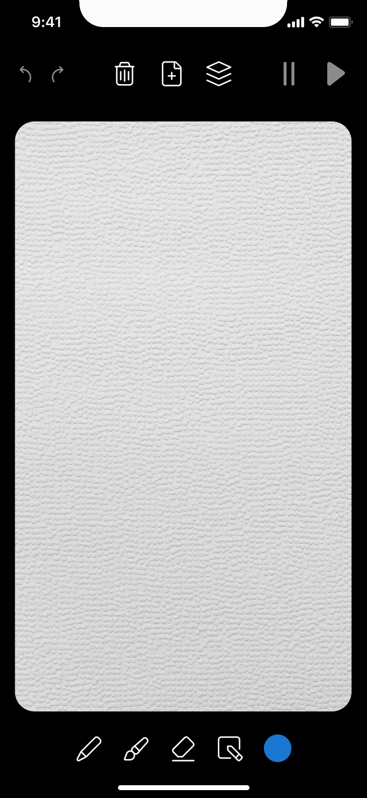

# Moving Pictures (Android) - Yandex Cup 2024

An Android application designed for frame-by-frame animation creation, allowing users to draw and playback animations on their smartphones. This app pays homage to early animation devices such as the phenakistoscope and zoetrope.

## Knowing issues
- No blocking execution on actions
  - Fix by moving all actions to IO\Default state and do at least screen blocking
  - You can reproduce it on fast layer duplication
- Glowing on popups
  - It's because of the custom BlurSurface implementation. It's cool and easy solution for that short time, but it can be fixed by reworking the layer snapshot
- Drawing object optimization
  - Have to optimize Path, Offset, and eth
  - It should use hashmap for drawing objects to cached objects

## Implementations
- [All features with videos](https://drive.google.com/drive/folders/1MnbSmebaZYbH1EDEs9NnTONmD3n-J2JU?usp=drive_link)

## Key Features

- **Interface and Controls**
  - Drawing toolbar with options for pencil, eraser, and additional optional tools
  - Drawing canvas mimicking a paper texture, with a semi-transparent preview of the previous frame to help create smooth animations

- Control panel:
  - Undo and redo buttons
  - Frame management: create, delete, and view existing frames
  - Playback control: start and stop animation with looping playback

- **Drawing Tools**
  - Pencil and eraser with a minimum of 3 color options
  - Undo/redo functionality for the last action
  - Support for unlimited frames

- **Application Requirements**
  - Supports API level 24+
  - Standalone UI developed without third-party libraries (using only standard Android libraries)
  - Compatibility with both light and dark themes

## Additional Features

1. **Random Frame Generation** — users can generate N random frames with different images.
2. **Frame Viewing and Navigation** — allows frame switching via a storyboard or swipes.
3. **Frame Duplication and Bulk Deletion**.
4. **Animation Speed Control**.
5. **GIF Export** — save and share animations as GIF files.
6. **Advanced Drawing Tools** — custom color selection, tools for drawing shapes and lines, brush and eraser thickness adjustment, canvas zoom for detailed drawing.

## Archive Contents

- **APK file** of the application, ready for Android installation
- **source.url** — link to the repository containing the project’s source code

## Additional Resources

- [Designs on Figma](https://www.figma.com/design/6QDUA0q5WZV6Fihhw5vPf7/%D0%9F%D1%80%D0%B8%D0%BB%D0%BE%D0%B6%D0%B5%D0%BD%D0%B8%D0%B5-Yandex-Cup-2024-(Copy)?node-id=0-1&t=5LEGC5cfpOYYAQiA-1)
- [Original Technical Task](https://contest.yandex.ru/contest/69723/problems?lang=ru)

## Getting Started

1. Clone the repository
2. Build and install the APK on an Android device with API level 24+
3. Use the provided tools to create and play animations
